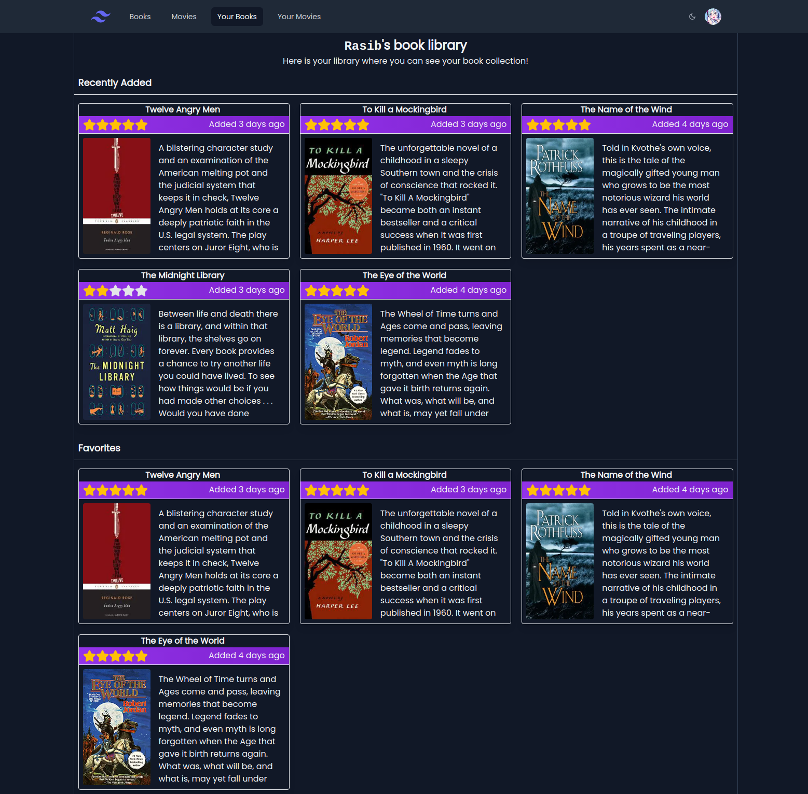
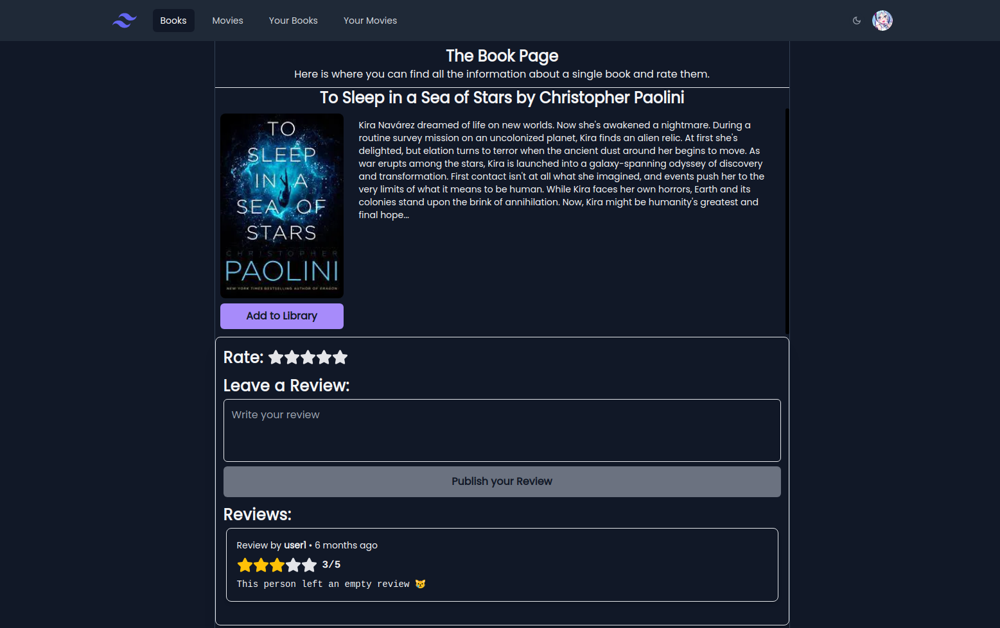
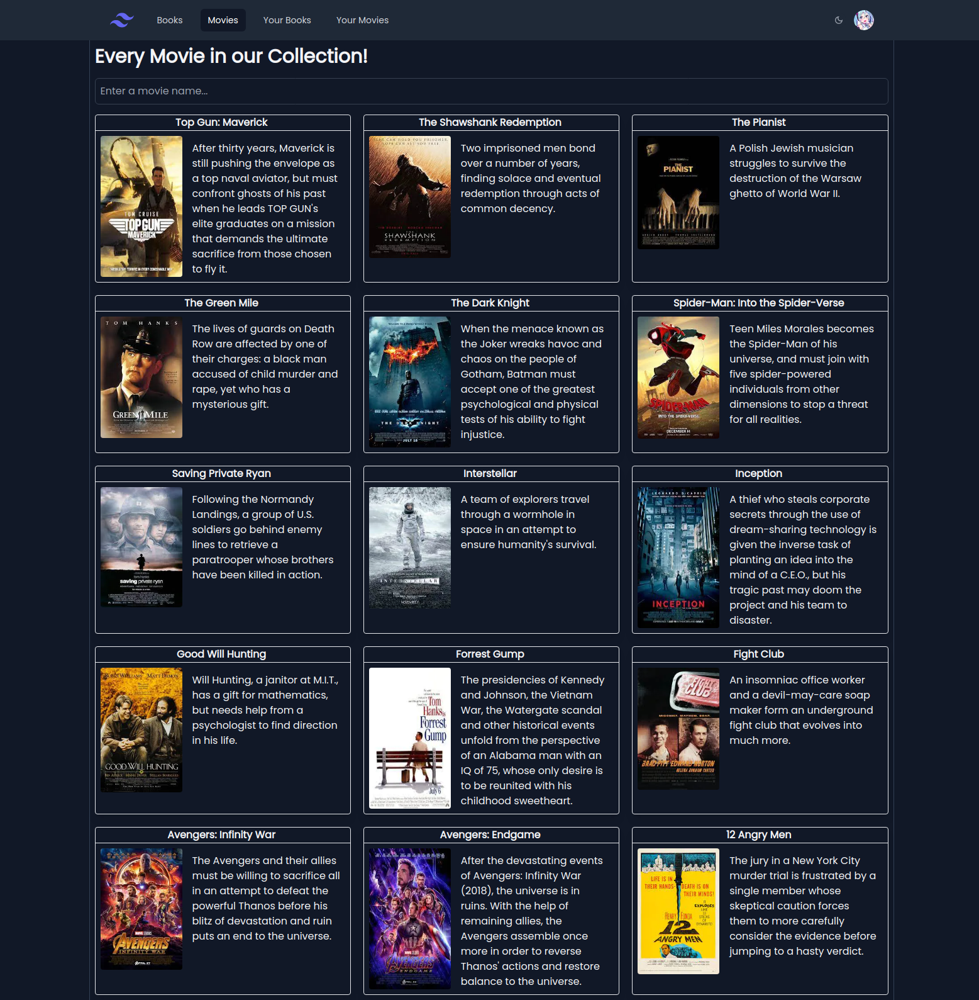

# Catalog Website Project

This project is a catalog website built using Next.js, tRPC, and Prisma. It allows users to browse and explore various items in the catalog. The project is deployed on Vercel, and you can visit the live website [here](https://media-tracking-website.vercel.app/).



## Technologies Used

The following technologies were used to develop this catalog website:

- Next.js: A React framework for building server-side rendered and static websites.
- tRPC: A next-generation TypeScript API framework for building APIs with strong typing and automatic code generation.
- Prisma: A modern database toolkit for TypeScript and Node.js that provides an ORM (Object-Relational Mapping) layer for database interactions.
- Vercel: A cloud platform for static sites and serverless functions.



## Features

- Browse and search for items in the catalog.
- Designed responsive for mobile users.
- View detailed information about each item, including images, descriptions, and reviews.
- User authentication and account management.

## Getting Started

To get started with the project, follow these steps:

1. Clone the repository:

   ```bash
   git clone https://github.com/your-username/catalog-website.git
   ```

2. Install the dependencies:

   ```bash
   cd catalog-website
   npm install
   ```

3. Set up the environment variables:
   - Create a `.env` file in the root directory of the project.
   - Define the required environment variables in the `.env` file, such as database connection details and API keys.

4. Run the development server:

   ```bash
   npm run dev
   ```

   The website should now be running on [http://localhost:3000](http://localhost:3000).



## License

This project is licensed under the [MIT License](LICENSE). Feel free to use and modify the code as per your requirements.

## Acknowledgements

- [Next.js Documentation](https://nextjs.org/docs)
- [tRPC Documentation](https://trpc.io/docs)
- [Prisma Documentation](https://www.prisma.io/docs)
- [Vercel Documentation](https://vercel.com/docs)
